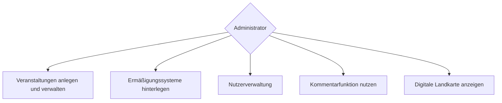
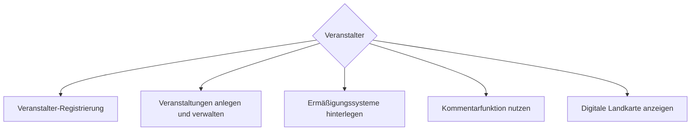
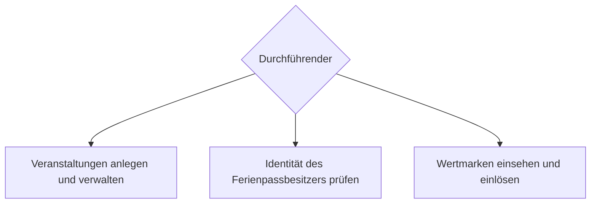
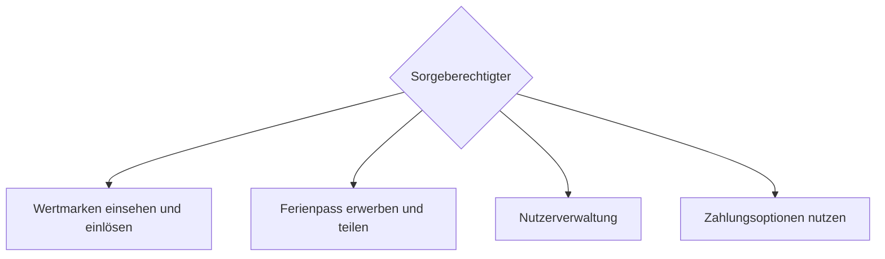
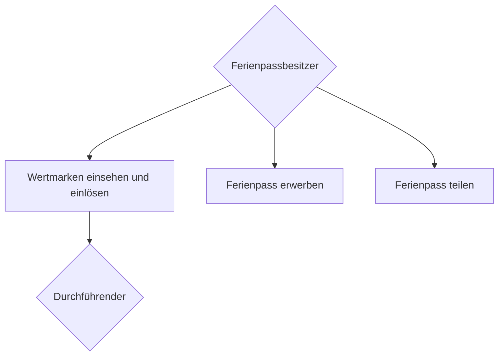
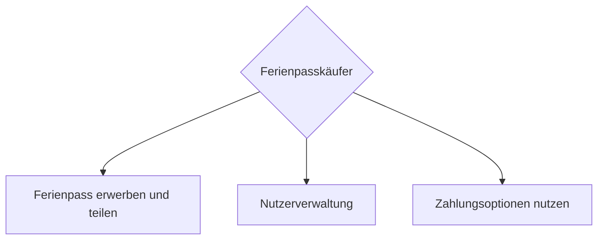

Key Features:
- Die Anwendung des „Digitalen Ferienpasses“ stellt dabei ein Modul in einem größeren Gesamtkonzept dar. Deshalb soll es so konzeptioniert und erstellt werden, damit es in einfacher Form zukünftig als Teilmodul in eine größere Ferien-Plattform mit anderen Projekten eingegliedert werden kann aber auch für sich einzeln stehen kann.
- Mobile First bei der Entwicklung
- Bilingual (mindestens Deutsch/Englisch)
- Es soll neben der Möglichkeit der Überweisung, welche als Aufforderung per Mail erfolgt auch die Möglichkeit einer Lastschrift vorhanden sein. Zudem sollen der Zahlungsdienstleister PayPal und Sofortüberweisung mit eingebunden werden.
- Die einzelnen Model sollen aber auch im Sinne der Übertragbarkeit auch für sich selbst funktionieren können

# Ferienportal

Das Ferienportal soll mit den Modulen Ferienabenteuer (bereits erstellt), Ferienpass und Ferienprogramm modular aufgebaut sein

```mermaid
graph TD;
    Ferienportal(("Ferienportal \n WebApp")) --> Ferienabenteuer(("Ferienabenteuer \n (bereits erstellt)"))
    Ferienportal --> DigitalerFerienpass(("DigitalerFerienpass \n Mobile APP"))
    Ferienportal --> Ferienprogramm((Ferienprogramm))

    Ferienprogramm --> Veranstaltungsplanung
    Ferienprogramm --> SelbstregistrierungVeranstalter
    Ferienprogramm --> Rollenaufteilung
    Ferienprogramm --> Ermäßigungssystem
    Ferienprogramm --> Barrierefreiheit
    Ferienprogramm --> Buchungsbegrenzung

    DigitalerFerienpass --> QRCode
    DigitalerFerienpass --> OfflineModus
    DigitalerFerienpass --> PDFDokument

    Ferienportal --> Zahlungsoptionen
    Ferienportal --> CMS
    Ferienportal --> SSO
    Ferienportal --> Kommentarfunktion
    Ferienportal --> DigitaleLandkarte
  ```


# Rollen && Zielgruppen

Erklärung der Beziehungen:

- **Administrator**: Hat die übergeordnete Kontrolle und interagiert mit allen anderen Rollen.
- **Veranstalter**: Erstellt und verwaltet Angebote, interagiert mit Durchführenden, Ferienpassbesitzern, und Ferienpasskäufern.
- **Durchführender**: Führt Veranstaltungen durch, überprüft die Identität und entwertet Wertmarken von Ferienpassbesitzern und Ferienpasskäufern.
- **Sorgeberechtigter**: Kann Ferienpässe für Kinder erwerben und interagiert mit allen anderen Rollen, insbesondere für Verwaltungs- und Zahlungszwecke.
- **Seitenbesucher**: Kann sich über das Ferienportal informieren und hat primär eine lesende Interaktion.
- **Ferienpassbesitzer**: Kinder und Jugendliche, die die Wertmarken einlösen, interagieren mit Administratoren, Veranstaltern, Durchführenden und Sorgeberechtigten.
- **Ferienpasskäufer**: Erwerben Ferienpässe, interagieren mit Administratoren, Veranstaltern, Durchführenden, Sorgeberechtigten und Ferienpassbesitzern.

```mermaid
graph LR;
    Admin{Administrator}
    Veranstalter{Veranstalter}
    Durchfuehrender{Durchführender}
    Sorgeberechtigter{Sorgeberechtigter}
    Seitenbesucher{Seitenbesucher}
    Ferienpassbesitzer{Ferienpassbesitzer}
    Ferienpasskaeufer{Ferienpasskäufer}

    Admin -- "Verwaltet Nutzer und Angebote" --> Veranstalter
    Admin -- "Verwaltet Nutzer und Veranstaltungen" --> Durchfuehrender
    Admin -- "Verwaltet Nutzer" --> Sorgeberechtigter
    Admin -- "Verwaltet Nutzer und Ferienpass" --> Ferienpassbesitzer
    Admin -- "Verwaltet Nutzer und Ferienpass" --> Ferienpasskaeufer

    Veranstalter -- "Erstellt und verwaltet Angebote" --> Admin
    Veranstalter -- "Koordiniert Veranstaltungen" --> Durchfuehrender
    Veranstalter -- "Bietet Angebote an" --> Ferienpassbesitzer
    Veranstalter -- "Bietet Angebote an" --> Ferienpasskaeufer

    Durchfuehrender -- "Führt Veranstaltungen durch" --> Veranstalter
    Durchfuehrender -- "Prüft Identität und entwertet Wertmarken" --> Ferienpassbesitzer
    Durchfuehrender -- "Prüft Identität und entwertet Wertmarken" --> Ferienpasskaeufer

    Sorgeberechtigter -- "Kauft und verwaltet Ferienpässe" --> Admin
    Sorgeberechtigter -- "Registriert und verwaltet Kinder" --> Veranstalter
    Sorgeberechtigter -- "Registriert und verwaltet Kinder" --> Durchfuehrender
    Sorgeberechtigter -- "Verwaltet Ferienpässe" --> Ferienpassbesitzer
    Sorgeberechtigter -- "Kauft Ferienpässe" --> Ferienpasskaeufer

    Seitenbesucher -- "Informiert sich" --> Admin
    Seitenbesucher -- "Informiert sich" --> Veranstalter
    Seitenbesucher -- "Informiert sich" --> Durchfuehrender

    Ferienpassbesitzer -- "Nutzt Angebote und Veranstaltungen" --> Admin
    Ferienpassbesitzer -- "Nutzt Angebote" --> Veranstalter
    Ferienpassbesitzer -- "Löst Wertmarken ein" --> Durchfuehrender
    Ferienpassbesitzer -- "Empfängt und nutzt Ferienpässe" --> Sorgeberechtigter

    Ferienpasskaeufer -- "Kauft und teilt Ferienpässe" --> Admin
    Ferienpasskaeufer -- "Kauft Ferienpässe" --> Veranstalter
    Ferienpasskaeufer -- "Kauft und teilt Ferienpässe" --> Durchfuehrender
    Ferienpasskaeufer -- "Kauft und teilt Ferienpässe" --> Sorgeberechtigter
    Ferienpasskaeufer -- "Kauft und teilt Ferienpässe" --> Ferienpassbesitzer
```


## Administrator


## Veranstalter



## Durchführender



## Sorgeberechtigter



## Ferienpassbesitzer


## Ferienpasskäufer


