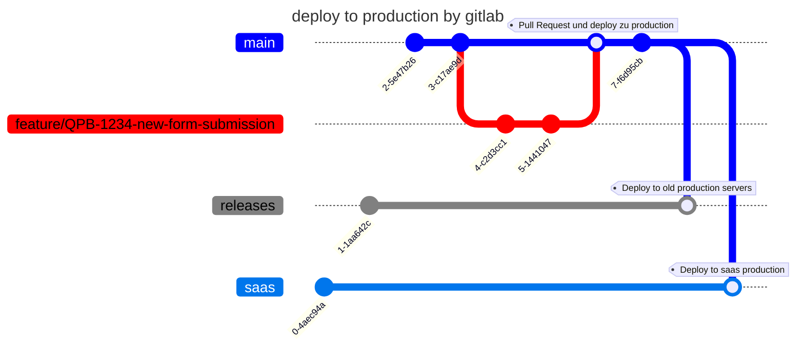

# Neues Feature entwickeln

`master` ist hier in der Abbildung `main` genannt.

Neue Feature Branch die alle Kommunen betreffen, gehen von `master` ab.
Der Branchname enthält unter anderem die Jira Ticket ID `feature/QPB-1234-new-form-submission`.

## develop feature and deploy to staging server

## Deploy to production servers by gitlab

