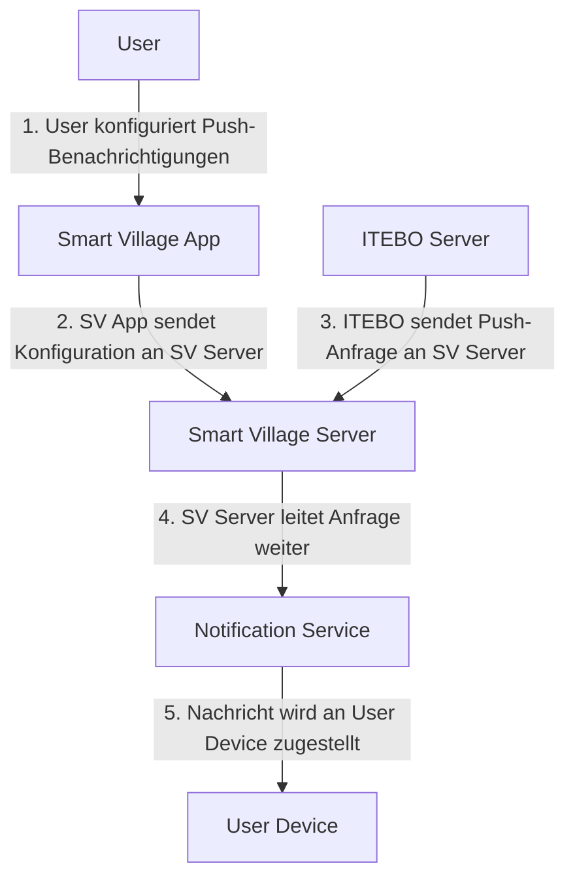

### Konzept zur Verknüpfung von Member Accounts mit Externen Services für ITEBO

#### 1. Verknüpfung der Member Accounts mit denen der Externen Services
Das beiliegende Dokument beschreibt zwei mögliche Verknüpfungsprozesse:

1. **OAuth2-Flow**
2. **Verknüpfung mittels Code oder QR-Code**

#### 2. Push-Dienstleistungen von der ITEBO
Jeder Member soll individuell konfigurieren können, welche Push-Dienstleistungen von der ITEBO er erhalten möchte. Dies wird über eine Konfigurationsseite innerhalb der Smart Village App realisiert werden, wo der Nutzer spezifische Benachrichtigungen aktivieren oder deaktivieren kann.

#### 2. API Endpunkte und Datenfluss
abseits der Authentifizierung und Autorisierung, werden folgende API Endpunkte von der Smart Village App bereitgestellt, um Push-Anfragen von der ITEBO zu empfangen und an den Kunden weiterzuleiten. Die Anfragen werden nach Thematischen Kategorien gefiltert sein müssen, damit die Kunden steuern können, welche Benachrichtigungen sie erhalten möchten.

Weitere Endpunkte können hinzugefügt werden, um die Verknüpfung zu erweitern und zusätzliche Funktionen zu ermöglichen, wie zum Beispiel der Status des Postfaches bei der ITEBO.

#### 4. Randfälle und mögliche Szenarien

**Szenario 1: Member hat bereits einen Account bei der ITEBO**
- **Verknüpfung**: Der Member kann seinen bestehenden Account durch den OAuth2-Flow oder durch Eingabe eines Verifizierungscodes/QR-Codes verknüpfen.
- **Trennung**: Über eine entsprechende Option in der App kann der Member die Verknüpfung wieder trennen.

**Szenario 2: Member hat keinen Account bei der ITEBO**
- **Erstellung und Verknüpfung**: Der Member kann direkt über die App einen neuen Account bei der ITEBO erstellen und diesen sofort verknüpfen.
- **Erstellung, Verknüpfung und Trennung**: Der Member kann einen Account erstellen, verknüpfen und bei Bedarf wieder trennen.

#### 5. Vorteile und Mehrwerte durch Verknüpfung

**Minimalvariante (QR-Code)**
- **Identifikation und Benachrichtigung**: Durch die Verknüpfung können Member gezielt über neue Nachrichten oder Ereignisse bei der ITEBO informiert werden. Es gibt jedoch nur ein Mapping zwischen den IDs der Kunden von SVA und ITEBO.
- **Einseitige Kommunikation/Aktion von der ITEBO zum SmartVillage Kunden**: ITEBO kann Aktionen und Informationen nur direkt an die SmartVillage Server senden. Es besteht keine Möglichkeit für SmartVillage Kunden, Aktionen oder Informationen in OpenRathaus auszulösen.

**Maximalvariante (OAuth2)**
- **Nahtlose Integration**: Durch OAuth2 können Member zukünftig direkt in der Smart Village App auf Dienste und Mehrwertangebote von OpenRathaus zugreifen, ohne sich mehrfach authentifizieren zu müssen.
- **Erweiterte Funktionen**: OAuth2 ermöglicht langfristige Verknüpfungen und die automatische Erneuerung von Zugriffstokens, was eine kontinuierliche Interaktion und Nutzung der Dienste ermöglicht.

#### 6. Serviceleistungen von OpenRathaus

OpenRathaus bietet eine Vielzahl an Dienstleistungen, die für Kunden der SmartVillageApp interessant sein könnten, darunter:

1. **Bürgerkonto**: Ein zentrales Benutzerkonto für alle Verwaltungsvorgänge.
2. **Postkorb**: Zentraler Eingang für digitale Kommunikation mit der Verwaltung.
3. **Formularserver**: Bereitstellung und Bearbeitung von digitalen Formularen.
4. **BUS / Infodienste**: Bereitstellung von Bürger- und Unternehmensservices [oai_citation:1,Über uns | Download: OPENRATHAUS](https://www.open-rathaus.de/ueber-uns/download/).

Durch diese Verknüpfungsmöglichkeiten können beide Systeme, OpenRathaus und SmartVillageApp, ihre Synergien optimal nutzen und den Mitgliedern eine erweiterte und verbesserte Nutzererfahrung bieten.

