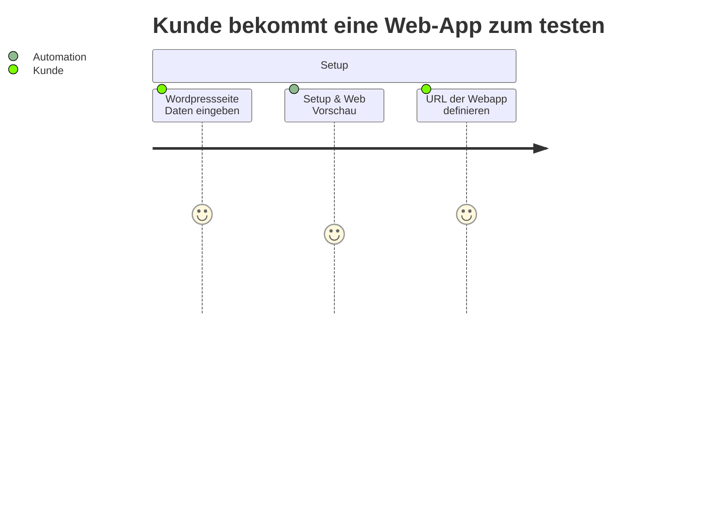
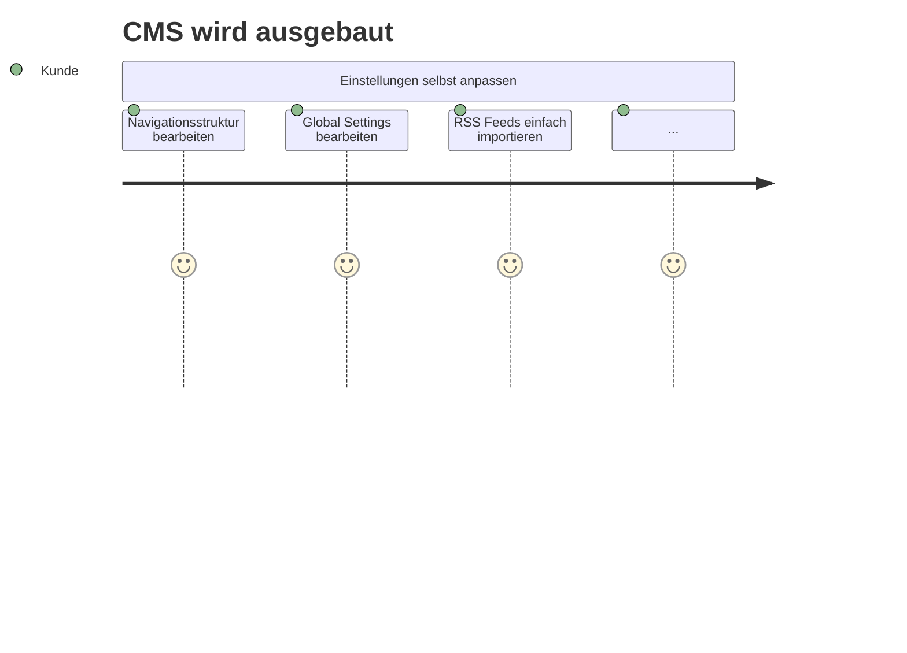
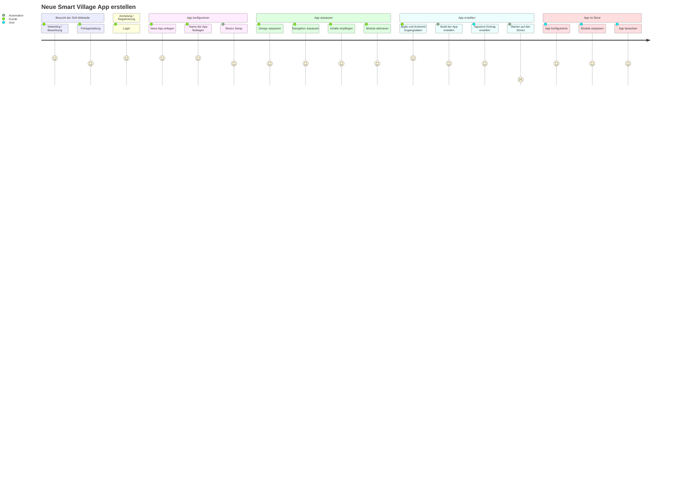
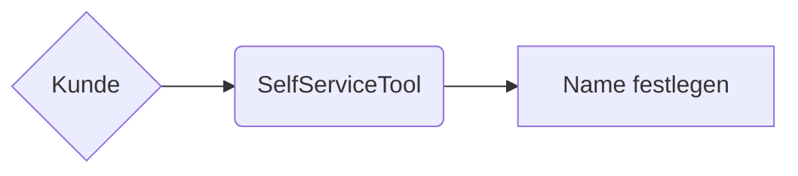

# Grundlagen

- es gibt mehrere Puzzlesteine
  - App
  - Mainserver
  - CMS
  - Datenquellen/Importer

# Grundlegende Ziele des SelfService Tools:

- bis 2027 500 AppKunden ohne nennenswerte Personalaufstockung
- Demo App für Kunden
- Vorschau der app in der Webseite
- Schnelles Aufsetzen von Apps
- Preiskalkulator

# Aktuelle Probleme
- Navigationsstruktur einfach bearbeitbar
- Einzelne Configs müssen aus der App ausgelagert werden in den Mainserver
- Farbgestaltung soll im Mainserver möglich sein
- Auf der Homepage der SVA soll "etwas" zusammenstellbar sein
- Wie ist der aktuelle Onboarding Prozess?

# Gefahren
- Meinung der Bestandskunden wichtig
- Mundpropaganda ist ein wichtiges Marketingtool

# Ablauf eines Onboarding Prozesses
- App Store Zugänge beschaffen
- App aufsetzen
- Neuen Mandanten anlegen
- Manuelle Inhalte einpflegen
- Datenquellen anbinden

# Konkurrenz
- OSCA - Open Smart City App (angeblich Open Source)
- HeiDi App - Heimat digital (angeblich Open Source)
- Appbaukästen (offiziell nicht OpenSource)
- Single App Lösungen für mehrere Städte
  - City Key App (Telekom)
  - Dorffunk

# Ausbauideen innerhalb der App
- KI gestützte Suche
- KI gestütztes App Setup

# Ausbauideen Allgemein
- E-Learning
- Appstore für externe Module (wie bei Webflow, Wordpress, ...)

# Zielgruppen / Kunden der Zukunft
- Entscheider sind Bürgermeister der Gemeinden und Städte
- Umsetzer sind die Mitarbeiter der Gemeinden und Städte
- Nutzer sind Bürger

# Budget
- 50.000€ bis 100.000€

# Hinweise für später
- Bei einem SelfService Tool muss es auch Testgruppen geben
- Features nicht direkt für alle freigeben
- Angemeldete User können Features Vorab testen
- Testdaten und schnelles löschen der Testdaten
- Cleanup von Testapps, Nach Ablaufzeit löschen
- SelfServiceTool muss eigenständige App sein, die den SaaS Dienst per API ansteuert
  - Externe Dienste werden an diese App angebunden
- Kommunen müssen meist Ausschreiben, ein kompletter Setup Weg ist kaum möglich

# Brainstorming
- Musterapp powered by SVA
- Musterzugang zum CMS, .... Täglicher Reset
- Webvorschau

# SelfServiceTool - Kunde wird hungrig

# SelfServiceTool - Kunde wird satt

# SelfServiceTool - Kunde macht alles Alleine

